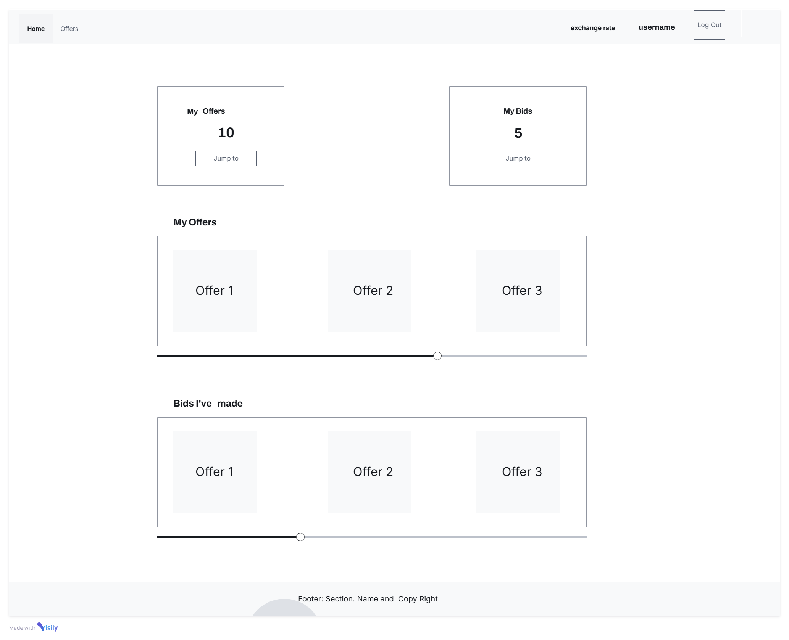
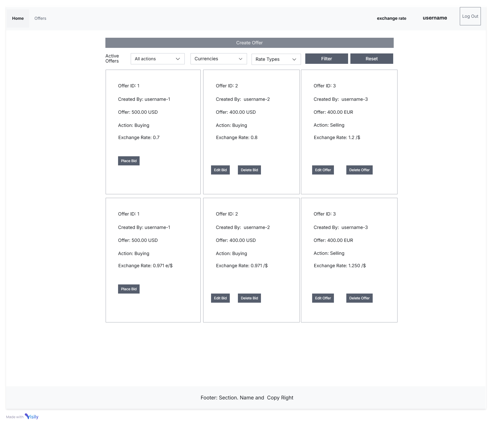
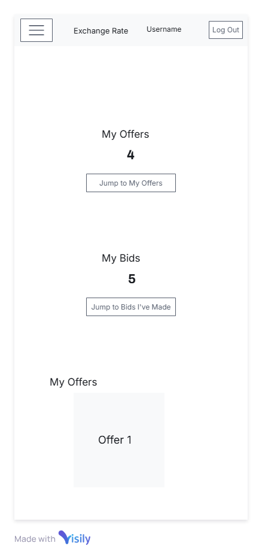
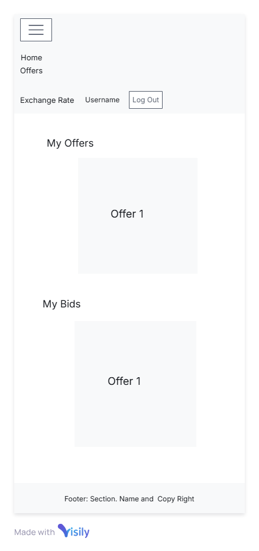
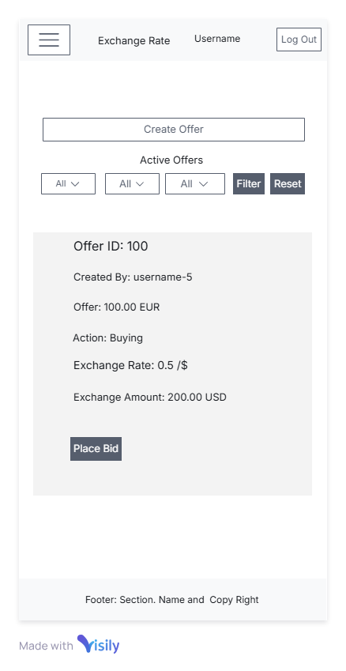
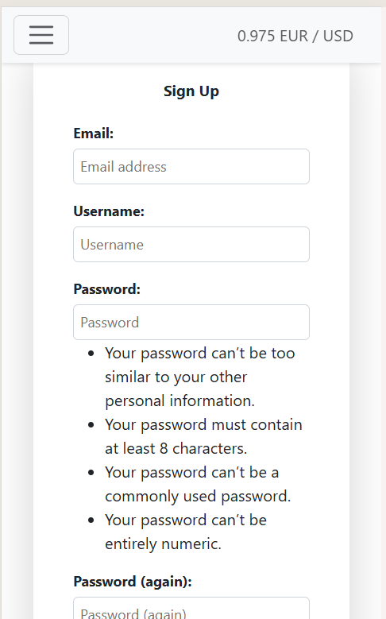
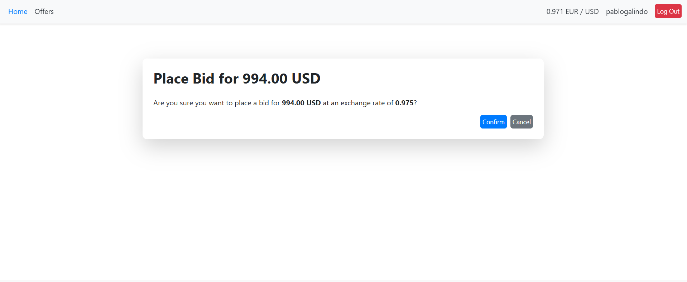

# **Currency Exchange Portal**

A web-based platform designed for a community of Ecuadorian school alumni to manage currency exchange offers efficiently. The platform resolves challenges posed by informal WhatsApp-based currency exchanges.

---

## **CONTENTS**
- [**Currency Exchange Portal**](#currency-exchange-portal)
  - [**CONTENTS**](#contents)
  - [**Introduction**](#introduction)
    - [**Background of the Idea**](#background-of-the-idea)
    - [**Purpose of the Portal**](#purpose-of-the-portal)
    - [**Value Proposition**](#value-proposition)
  - [**Agile Methodology**](#agile-methodology)
    - [**Project Management**](#project-management)
      - [**GitHub Project Workflow**](#github-project-workflow)
    - [**Epics**](#epics)
      - [**1. User Management**](#1-user-management)
      - [**2. Offer Management**](#2-offer-management)
      - [**3. Offer Bidding and Management**](#3-offer-bidding-and-management)
      - [**4. Filters and Dashboard**](#4-filters-and-dashboard)
    - [**Benefits of Using Agile**](#benefits-of-using-agile)
  - [**User Experience (UX)**](#user-experience-ux)
    - [**User Stories**](#user-stories)
      - [**Placing a Bid**](#placing-a-bid)
      - [**Managing Offers**](#managing-offers)
      - [**Viewing and Managing Bids**](#viewing-and-managing-bids)
      - [**Dashboard**](#dashboard)
      - [**Filter**](#filter)
  - [Design](#design)
    - [Colour Scheme](#colour-scheme)
    - [Typography](#typography)
    - [Imagery](#imagery)
    - [Component Highlights](#component-highlights)
      - [**Wireframes**](#wireframes)
  - [**Features and Architecture**](#features-and-architecture)
    - [**Features**](#features)
      - [**User Authorization**](#user-authorization)
      - [**Offer Management**](#offer-management)
      - [**Bid Management**](#bid-management)
      - [**Dashboard**](#dashboard-1)
      - [**Filters**](#filters)
      - [**External Integrations**](#external-integrations)
      - [**Admin Panel**](#admin-panel)
    - [**Responsive Design**](#responsive-design)
    - [Application Features at a Glance](#application-features-at-a-glance)
      - [**Future Implementations**](#future-implementations)
    - [**Architecture**](#architecture)
      - [**Application Structure**](#application-structure)
      - [**Database Design**](#database-design)
      - [**Scalability**](#scalability)
    - [**Database and Models**](#database-and-models)
      - [**User**](#user)
      - [**Offer**](#offer)
      - [**Bid**](#bid)
      - [**LatestExchangeRate**](#latestexchangerate)
  - [**Technologies Used**](#technologies-used)
    - [**Languages Used**](#languages-used)
    - [**Frameworks, Libraries \& Programs Used**](#frameworks-libraries--programs-used)
    - [**Tools \& Services**](#tools--services)
  - [**Deployment \& Local Development**](#deployment--local-development)
    - [**Deployment**](#deployment)
      - [**Updating Exchange Rates**](#updating-exchange-rates)
    - [**Local Development**](#local-development)
      - [**Clone the Repository**](#clone-the-repository)
      - [**Setup Environment**](#setup-environment)
  - [**Testing**](#testing)
  - [**Bugs Encountered**](#bugs-encountered)
  - [**Credits**](#credits)
  - [**Credits**](#credits-1)
    - [Contact](#contact)

---

## **Introduction**

### **Background of the Idea**
The alumni community of an Ecuadorian school spans across different countries, with many residing in Europe. Currency exchanges (USD ↔ EUR) are frequent due to Ecuador’s USD-based economy and the community’s presence in Europe.

Currently, the exchanges occur informally via WhatsApp, posing several challenges:
1. **Spamming**: Chat groups become cluttered with exchange posts.
2. **No Rate Reference**: Lack of clear or reliable exchange rates.
3. **No Tracking**: Offers and responses are hard to follow.
4. **Inefficient Matching**: Finding suitable exchange partners is tedious.

---

### **Purpose of the Portal**
The Currency Exchange Portal resolves these challenges by providing:
- A dedicated, spam-free platform to manage offers and bids.
- Real-time exchange rates for transparency.
- Features to create, manage, and filter offers efficiently.

---

### **Value Proposition**
The portal simplifies the currency exchange process, ensuring:
- Time savings.
- Organized tracking.
- Reduced spam.
- A user-friendly experience tailored for the alumni community.

---


## **Agile Methodology**

The development of the Currency Exchange Portal followed an agile methodology, leveraging GitHub Projects to manage user stories and track progress. The project was divided into four main epics (milestones), each representing a critical area of functionality. This approach ensured incremental delivery and continuous feedback.

---

### **Project Management**
1. **GitHub Repository**: The codebase was managed in a GitHub repository, providing version control and collaboration tools.
2. **GitHub Projects**: A [GitHub Project Board](https://github.com/users/galindo89/projects/2) was created to manage user stories, track progress, and organize tasks.

#### **GitHub Project Workflow**
- **Columns**:
  - **Backlog**: Contains all user stories yet to be implemented.
  - **In Progress**: Tasks currently being worked on.
  - **Done**: Finished tasks successfully merged and deployed.
- Each user story was represented as a GitHub issue linked to the project board.

---

### **Epics**
The project was structured into four main epics, each focusing on a specific feature set:

#### **1. User Management**
- Implemented user registration, login, and authentication.
- Managed user sessions and permissions for accessing offers and bids.

#### **2. Offer Management**
- Developed features for creating, editing, and deleting offers.
- Enabled users to view offers in a streamlined and organized interface.
- Restricted editing for offers with accepted bids.

#### **3. Offer Bidding and Management**
- Allowed users to place, edit, and delete bids on offers.
- Added functionality for offer creators to view, accept, and reject bids.
- Integrated contact sharing between offer creators and accepted bidders.

#### **4. Filters and Dashboard**
- Added a dashboard to provide users with an overview of their offers and bids.
- Implemented filtering options to allow users to search and sort offers efficiently.

---

### **Benefits of Using Agile**
- **Incremental Delivery**: Features were delivered in small increments, allowing for early feedback and iterative improvements.
- **Transparency**: The GitHub project board provided a clear view of the project's progress and priorities.
- **Flexibility**: Changes in requirements were easily accommodated due to the modular structure of the epics and stories.
- **Collaboration**: GitHub enabled seamless collaboration through issues, pull requests, and discussions.


---

## **User Experience (UX)**

### **User Stories**
#### **Placing a Bid**
- As a user, I want to place a bid on an offer so that I can express my interest.
- As a user, I want to update my bid if the offer has a flexible exchange rate and my bid is still pending.
- As a user, I want to delete a bid I’ve placed so that I can withdraw my interest in an offer.

#### **Managing Offers**
- As a user, I want to create offers so that I can list my currency exchange needs.
- As a user, I want to edit my offers if no bids have been accepted.
- As a user, I want to delete offers I no longer need.

#### **Viewing and Managing Bids**
- As a user who created an offer, I want to view all bids placed on my offer.
- As a user who created an offer, I want to accept or reject bids.
- As a user who created an offer, I want to share my contact details with an accepted bidder.

#### **Dashboard**
- As a user, I want to see a summary of the total number of offers I have created and bids I have placed.
- As a user, I want to quickly navigate to the offers I have created or the bids I have placed using dedicated shortcuts.
- As a user, I want to see detailed metrics about my activity to track my progress and engagement with the platform.

#### **Filter**
- As a user, I want to filter offers by currency (e.g., USD, EUR) to find offers relevant to me.
- As a user, I want to filter offers by action type (e.g., buy or sell) to focus on the offers I’m interested in.
- As a user, I want to filter offers by rate type (e.g., flexible or fixed) to find offers that match my preferences.
- As a user, I want to combine filters to narrow down the list of offers efficiently.

---

## Design

### Colour Scheme
The color scheme was chosen to create a clean and professional appearance, ensuring the user interface is easy to navigate and visually appealing.

- **Primary Colors:**
  - **Header and Footer Background:** `#f8f9fa` (Light Gray)
  - **Navbar Text and Links:** `#343a40` (Dark Gray)
  - **Hover Links:** `#007bff` (Blue)
  - **Body Background:** White (`#ffffff`)
- **Text Colors:**
  - **Headings:** Black (`#000000`)
  - **Primary Text Color:** Dark Gray (`#343a40`)
  - **Help Text for Forms:** `#6c757d` (Muted Gray)
- **Button Colors:**
  - **Primary Button Background:** `#007bff` (Blue)
  - **Primary Button Hover Background:** `#0056b3` (Dark Blue)
  - **Success Alerts and Messages:** `#28a745` (Green)
  - **Error Alerts and Messages:** `#dc3545` (Red)
  - **Warning Alerts:** `#ffc107` (Yellow)
  - **Info Alerts:** `#17a2b8` (Teal)
- **Borders and Miscellaneous:**
  - **Input Borders:** `#ced4da` (Light Gray)
  - **Hover Effects for Action Buttons:** `#80bdff` (Light Blue Outline)

---

### Typography
For typography, the platform uses a bold and modern style for headings, ensuring clarity and readability.  
- **Headings (H1, H2, H3):** Bold font for emphasis.
- **Text Size Adjustments:** Responsive typography across different screen sizes for a seamless user experience.

---

### Imagery
Minimal imagery is used to maintain focus on functionality. Instead, components like **cards** and **alerts** are styled to provide visual structure. Imagery is limited to icons and simple illustrations in sections like the dashboard.

---

### Component Highlights
- **Cards:** Used for dashboard and offers sections, styled with rounded corners (`border-radius: 10px`) and subtle shadows (`box-shadow: 0 4px 6px rgba(0, 0, 0, 0.1)`).
- **Hover Effects:** Action buttons (e.g., "edit" and "delete") appear only when hovering over cards.
- **Tables:** Tables are styled with alternating row colors for better readability (`.table-striped`).

---

#### **Wireframes**
Wireframes were created to plan the layout and user flow for the application. The tool to created the wireframes was [Visily](https://www.visily.ai/).

<details>
<summary><strong>Desktop Layout</strong></summary>
<br>

- **Dashboard Layout**  
  

- **Create Offer Layout**  
  

</details>

<details>
<summary><strong>Mobile Layout</strong></summary>
<br>

- **Dashboard Layout (First View)**  
  

- **Dashboard Layout (Second View)**  
  

- **Create Offer Layout**  
  

</details>


## **Features and Architecture**

### **Features**

#### **User Authorization**
- Users can register by creating an account with the following:
  - **Username**: Must be unique across the platform.
  - **Password**: Must meet security standards.
  - **Email**: Must be unique and valid.
- Validation ensures all necessary information is provided, with checks for:
  - Unique email and username.
  - Correctness and completeness of input data.
- **Password Reset Functionality**:
  - Accessible via a "Forgot Password" link on the login page.
  - Users provide their registered email to receive a reset link.
  - The reset link, sent via SendGrid, allows users to securely update their password.
  - Note: Emails may land in spam folders, and the sender is `pablo.galindozapata@gmail.com`.
- Unauthorized users are restricted from accessing any part of the platform.

#### **Offer Management**
- **Features**:
  - **Create Offers**: Users can list their intent to buy or sell currencies with parameters such as:
    - **Amount**: Mandatory (minimum: 1, maximum: 100,000).
    - **Currency**: USD or EUR (mandatory).
    - **Exchange Rate**: Optional (defaults to the latest recorded rate).
    - **Action**: Specify buying or selling (optional, defaults to buying).
    - **Rate Type**: Fixed or Flexible (optional, defaults to Fixed).
  - **Edit Offers**:
    - Editing is only available if no bids are accepted for the offer.
    - All fields except the owner can be modified.
    - Changes propagate to all related UI elements such as dashboards and bid summaries.
  - **Delete Offers**:
    - Always allowed for the creator, regardless of bid statuses.
    - System prompts for confirmation before deletion, and changes propagate across the app.
- **Rate Type Implications**:
  - **Fixed**: Exchange rate remains unchanged unless users edits it.
  - **Flexible**: Exchange rate updates automatically with system-wide rate changes.

#### **Bid Management**
- **Features**:
  - Users can place bids on existing offers if they meet conditions such as:
    - No prior bid exists for the same offer by the same user.
    - The offer is active.
  - Bids record the following details:
    - **Amount**: The full offer amount.
    - **Currency**: Corresponds to the offer's currency.
    - **Exchange Rate**: Captured at the time of bidding.
    - **Exchange Value**: Calculated based on the rate and amount.
- **Edit Bids**:
  - Allowed only for Flexible rate offers and bids with "Awaiting" status.
  - Updates propagate automatically across dashboards and summaries.
- **Delete Bids**:
  - Users can remove their bids at any time.
  - Changes are reflected immediately in all relevant views.
- **Bid Acceptance and Rejection**:
  - Offer creators can accept/reject bids via a detailed bid list.
  - Accepted bids allow contact sharing via a "Share Contact" button.
  - Contact sharing updates all relevant sections for both the offer creator and bidder.

#### **Dashboard**
- **Overview**:
  - Key metrics include:
    - Total active offers created by the user.
    - Total bids placed by the user.
  - Quick navigation buttons link to relevant sections for offers and bids.
- **Enhanced User Experience**:
  - Summarizes key activities and enables seamless navigation.

#### **Filters**
- Advanced filtering options include:
  - **Currency**: Filter by USD or EUR.
  - **Action**: View buying, selling, or all offers.
  - **Rate Type**: Choose between Flexible or Fixed rate offers.
- Enables users to narrow results to relevant offers efficiently.

#### **External Integrations**
- **Exchange Rate Updates**:
  - Automatically fetches the latest rates from OpenExchange at scheduled intervals.
  - Uses a Django management command to trigger updates via `update_exchange_rate.py`.
  - Changes propagate to all Flexible rate offers and related views.
  
#### **Admin Panel**
- The platform includes a comprehensive admin panel, leveraging Django's built-in admin interface.
- **Features**:
  - Manage users, offers, and bids efficiently through an intuitive dashboard.
  - Perform CRUD operations (Create, Read, Update, Delete) on all models.
  - The admin panel is accessible only to authorized administrators, ensuring platform security and data integrity.
  
### **Responsive Design**
The platform is fully responsive, providing a seamless experience across desktops, tablets, and mobile devices.

### Application Features at a Glance

The table below provides an overview of the application's features, showcasing their functionality and corresponding screenshots for a visual representation.
<details>
<summary>Click here to view the features table</summary>

| Feature            | Action                  | Device              | Screenshot                                                              |
|:-------------------|:------------------------|:--------------------|:------------------------------------------------------------------------|
| User Authorization | User Registration       | Mobile              |                   |
| User Authorization | User Log In             | Mobile              |                    |
| User Authorization | User Log Out            | Mobile              |                   |
| User Authorization | Password Reset          | Mobile              |            |
| User Authorization | User Registration       | Desktop and Tablets |                  |
| User Authorization | User Log In             | Desktop and Tablets |                   |
| User Authorization | User Log Out            | Desktop and Tablets |                  |
| User Authorization | Password Reset          | Desktop and Tablets |           |
| Offer Management   | Create Offer            | Mobile              |              |
| Offer Management   | Create Offer Validation | Mobile              |   |
| Offer Management   | Edit Offer              | Mobile              |              |
| Offer Management   | Create Offer            | Desktop and Tablets |             |
| Offer Management   | Create Offer Validation | Desktop and Tablets |  |
| Offer Management   | Edit Offer              | Desktop and Tablets |               |
| Offer Management   | Delete Offer            | Desktop and Tablets |             |
| Filters            | Filter                  | Mobile              |                    |
| Filters            | Filter                  | Desktop and Tablets |                   |
| Dashboard          | Active offers and Bids  | Mobile              |        |
| Dashboard          | My Offers Section       | Mobile              |         |
| Dashboard          | My Bids Section         | Mobile              |           |
| Dashboard          | Active offers and Bids  | Desktop and Tablets |       |
| Dashboard          | My Offers Section       | Desktop and Tablets |        |
| Dashboard          | My Bids Section         | Desktop and Tablets |          |
| Bid Management     | Create Bid              | Mobile              |                |
| Bid Management     | Edit Bid                | Mobile              |                  |
| Bid Management     | Edit Bid Validation     | Mobile              |       |
| Bid Management     | Delete Bid              | Mobile              |                |
| Bid Management     | Bid Acceptance          | Mobile              |            |
| Bid Management     | Sharing Contact         | Mobile              |           |
| Bid Management     | Create Bid              | Desktop and Tablets |               |
| Bid Management     | Edit Bid                | Desktop and Tablets |                 |
| Bid Management     | Edit Bid Validation     | Desktop and Tablets |      |
| Bid Management     | Delete Bid              | Desktop and Tablets |               |
| Bid Management     | Bid Acceptance          | Desktop and Tablets |           |
| Bid Management     | Sharing Contact         | Desktop and Tablets |          |
</details>

#### **Future Implementations**
To enhance the user experience and expand the application's capabilities, the following features are planned for future releases:

- **Enhanced Notifications**:
  - In-app and email notifications for bid activity, offer updates, and accepted bids.
- **Advanced Filters**:
  - Adding new filtering options such as time range and user-specific activity filters.
  - Implementing a keyword search bar for quick access to offers or bids.
- **Automatic Offer Matching**:
  - Introducing an algorithm to automatically match compatible offers based on criteria like currency, amount, and rate type, saving time for users.
- **Flexible Bidding**:
  - Allowing users to place bids for partial amounts on offers, providing more flexibility for both buyers and sellers.
- **Multi-Currency Support**:
  - Extending support to additional currencies to cater to a global audience.
- **User Profiles**:
  - Allowing users to customize their profiles with avatars, bios, and statistics about their activities.
  
---

### **Architecture**

#### **Application Structure**
- Built using the **Django Framework**, adhering to modular design principles.
- Organized into three core apps:
  - **Users**:
    - Manages authentication and user-related operations.
    - Integrates with Django-Allauth for streamlined management.
  - **Offers**:
    - Handles the creation, management, and processing of offers and bids.
    - Includes backend scripts for external API integrations.
  - **Core**:
    - Responsible for auxiliary features like dashboards and filtering.
    - Future-proofed for additional functionalities like support and contacts.

#### **Database Design**
- Relational database schema with clear relationships:
  - **User**: Base model for all platform users.
  - **Offer**: Represents currency exchange offers.
  - **Bid**: Tracks bids placed on offers.
  - **LatestExchangeRate**: Stores real-time currency rates.

#### **Scalability**
- Modular design supports:
  - Future integrations, such as alternative payment systems.
  - Expanding to new features like notifications or reporting tools.

---


### **Database and Models**

#### **User**
| Column Name   | Data Type   | Description             |
|---------------|-------------|-------------------------|
| id            | Integer     | Primary key            |
| username      | String      | Username of the user   |
| email         | String      | Email of the user      |

---

#### **Offer**
| Column Name     | Data Type   | Description                                  |
|-----------------|-------------|----------------------------------------------|
| id              | Integer     | Primary key                                 |
| user_id         | ForeignKey  | Links to `User.id`                          |
| currency        | String      | Currency type (e.g., USD, EUR)              |
| amount          | Decimal     | Amount of currency                         |
| exchange_rate   | Decimal     | Exchange rate                              |
| is_buying       | Boolean     | Whether it's a buy offer                   |
| rate_type       | String      | Rate type (Fixed or Flexible)              |
| created_at      | DateTime    | Timestamp when the offer was created        |

---

#### **Bid**
| Column Name      | Data Type   | Description                                  |
|------------------|-------------|----------------------------------------------|
| id               | Integer     | Primary key                                 |
| offer_id         | ForeignKey  | Links to `Offer.id`                         |
| user_id          | ForeignKey  | Links to `User.id`                          |
| amount           | Decimal     | Bid amount                                 |
| currency         | String      | Currency type                              |
| exchange_rate    | Decimal     | Exchange rate used in the bid              |
| created_at       | DateTime    | Timestamp when the bid was created          |
| status           | String      | Status of the bid (Awaiting, Accepted, Rejected) |
| contact_shared   | Boolean     | Indicates if contact info was shared        |

---

#### **LatestExchangeRate**
| Column Name      | Data Type   | Description                              |
|------------------|-------------|------------------------------------------|
| id               | Integer     | Primary key                             |
| base_currency    | String      | Base currency (e.g., USD)               |
| target_currency  | String      | Target currency (e.g., EUR)             |
| rate             | Decimal     | Exchange rate                          |
| timestamp        | DateTime    | Timestamp of the latest update          |

**Relationships**:
- **User** → **Offer**: One-to-Many (User.id → Offer.user_id).
- **Offer** → **Bid**: One-to-Many (Offer.id → Bid.offer_id).
- **User** → **Bid**: One-to-Many (User.id → Bid.user_id).
- **LatestExchangeRate** influences **Offer** (informational).

---


---


---

## **Technologies Used**

### **Languages Used**
- Python (Django)
- HTML5
- CSS3
- JavaScript

---

### **Frameworks, Libraries & Programs Used**
- **Django**: Web framework for building the backend and implementing management commands.
- **Bootstrap**: CSS framework for responsive styling.
- **SQLite**: Local database used during development.
- **PostgreSQL**: Database for the production environment.
- **Git & GitHub**: Version control and repository hosting.

---

### **Tools & Services**
- **Heroku**: Cloud platform for hosting the application.
- **Heroku Scheduler**: Add-on for automating tasks like running the `update_exchange_rate.py` script.
- **SendGrid**: Email service provider for sending password reset and notification emails.
- **OpenExchangeRates**: API service for fetching real-time exchange rates.
- **PEP8 Linter**: Tool for ensuring Python code adheres to style guidelines.
- **Coverage.py**: Tool for measuring test coverage in automated testing.
- **W3C Validators**: Tools for validating HTML and CSS code quality.
---

## **Deployment & Local Development**
### **Deployment**
The application is hosted on [Heroku](https://heroku.com).

Steps to deploy:
1. Push the code to a GitHub repository.
2. Link the repository to Heroku.
3. Configure the environment variables in Heroku as follows:
   - **`DATABASE_URL`**: Connection string for the PostgreSQL database. Example:  
     `postgresql://<username>:<password>@<host>/<database>`
   - **`DEBUG`**: Indicates whether debug mode is enabled. Set to `True` during development and `False` in production.
   - **`SECRET_KEY`**: A unique, secret key for the application. This should be a strong, random value.
   - **`SENDGRID_API_KEY`**: API key for SendGrid, used for email functionality.
   - **`OPENEXCHANGERATES_API_KEY`**: API key for OpenExchangeRates, used to fetch exchange rates.

4. Deploy the application via the Heroku dashboard.
---

#### **Updating Exchange Rates**
The application includes an `update_exchange_rate.py` script implemented as a Django management command to fetch and update exchange rates. This command can be executed in two ways:

1. **Running the Command Manually**:
   - Open the Heroku console from the Heroku dashboard.
   - Run the following command:
     ```bash
     python manage.py update_exchange_rate
     ```

2. **Automating with Heroku Scheduler**:
   - Install the **Heroku Scheduler** add-on from the Heroku dashboard.
   - Add a new job in the scheduler with the following command:
     ```bash
     python manage.py update_exchange_rate
     ```
   - Set the desired interval (e.g., every 10 minutes, hourly, or daily) to automatically fetch and update exchange rates.

> **Note:** Ensure that the `OPENEXCHANGERATES_API_KEY` environment variable is set correctly in Heroku for the script to function.

---
### **Local Development**

#### **Clone the Repository**
1. Open the terminal and navigate to your desired directory.
2. Run:
   ```bash
   git clone <repository-url>
   cd <repository-folder>
   ```

#### **Setup Environment**
1. Create a virtual environment:
   ```bash
   python -m venv venv
   source venv/bin/activate  
   ```
2. Install dependencies:
   ```bash
   pip install -r requirements.txt
   ```

3. Run migrations and start the server:
   ```bash
   python manage.py makemigrations
   python manage.py migrate
   python manage.py runserver
   ```

---

## **Testing**
- Comprehensive testing was conducted to ensure functionality across devices and browsers.
- Testing included:
  - Code Validation
  - Manual Testing
  - Automated Testing

For a detailed overview of the testing process, including test scenarios, results, and methodologies, please refer to the [TEST.md](TEST.md) file.

## **Bugs Encountered**

During the development and testing phases, the following bugs were identified and resolved:

<details>
<summary><strong>View Resolved Bugs</strong></summary>
<br>


| Bug Description                                                  | Solution                                                                          | Status              |
|------------------------------------------------------------------|----------------------------------------------------------------------------------|---------------------|
| Modal not retrieving information from offer or bid               | Replacing modals with templates                                                  | Fixed and deployed  |
| User being redirected automatically to the offer page            | Adding the `?next` query parameter to redirect users to the site of origin       | Fixed and deployed  |
| Users able to access application views after logging out         | Added `login_required` decorator to the views                                    | Fixed and deployed  |
| Filters not updating correctly by rate type                      | Fixed a mislabeled field in the filter logic                                     | Fixed and deployed  |

</details>


---

## **Credits**

## **Credits**

This project greatly benefited from the knowledge shared through various articles, documentation, and forums, as well as the support provided by Code Institute, its community of students, and my mentor. Additionally, several articles were instrumental in guiding me throughout the journey of implementing my application. Below is a list of resources that significantly contributed to the development process:

- **Password Validation and UI/UX Design**:
  - [Password Validation Strategies and Best Practices](https://www.uxgrowth.io/blog/password-validation-page-ux-ui-design-strategies-and-best-practices#:~:text=Clear%20communication%20of%20password%20requirements,meets%20the%20necessary%20security%20standards): Provided insights on designing user-friendly and secure password validation pages.

- **Django-Specific Guidance**:
  - [Django: Displaying List Objects in Templates](https://stackoverflow.com/questions/57288723/django-how-to-display-list-objects-from-model-in-base-html-and-extends-it-to): Helped implement efficient template inheritance for displaying list objects across pages.
  - [Django Custom Management Commands](https://docs.djangoproject.com/en/5.1/howto/custom-management-commands/): Guided the creation of the `update_exchange_rate.py` script.
  - [Django Crontab for Scheduled Tasks](https://medium.com/@mainadanielwachira/a-comprehensive-guide-to-using-django-crontab-for-scheduled-tasks-bb62b99083e8): Provided valuable insights into scheduling tasks in Django.

- **Bootstrap Integration**:
  - [Bootstrap Modals](https://getbootstrap.com/docs/4.0/components/modal/): Used for styling and implementing modal dialogs.

- **Form Handling in Django**:
  - [Passing Data into Django Forms](https://stackoverflow.com/questions/71187209/how-do-you-pass-data-into-a-django-form): Helped improve form functionality by passing additional data to forms.
  - [Passing Variables to All Templates](https://stackoverflow.com/questions/12030611/how-do-i-pass-variables-to-all-templates-in-django): Simplified the process of making variables available across all templates.

- **Security and CSRF Handling**:
  - [Django CSRF Validation Using Fetch](https://stackoverflow.com/questions/43606056/proper-django-csrf-validation-using-fetch-post-request): Ensured proper handling of CSRF tokens in POST requests.

- **Django Request and Response**:
  - [Attributes of Django Requests](https://docs.djangoproject.com/en/5.1/ref/request-response/#attributes): Helped in efficiently handling requests and responses.

- **Customizing Django Allauth**:
  - [Modifying Django Allauth Forms](https://gavinwiener.medium.com/modifying-django-allauth-forms-6eb19e77ef56): Guided the customization of authentication-related forms for a better user experience.

These resources provided essential guidance and inspiration during the development process. My thanks to the authors and contributors who shared their knowledge.


- **Author**: Pablo Galindo.
- **Acknowledgments**:
  - Thanks to Django and Bootstrap documentation for guidance.
  - Gratitude to the Code Institute community for their support and helpful resources.
  - Thanks to Stack Overflow for helping me solve several issues I faced during the implementation. For example, they helped me figure out how to implement the function to calculate the days left. For more information, check this link.

---
 
### Contact
For more information, please contact [pablo.galindozapata@gmail.com].