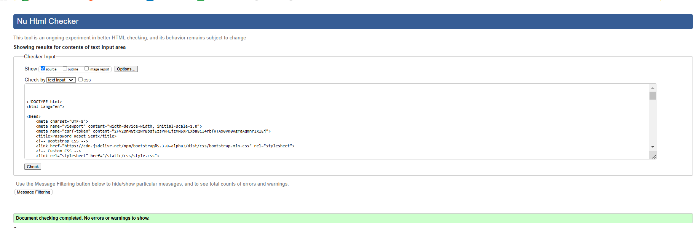

# **Testing**

For this project an extensive set of test scenarios was defined to verify the application was working as expected.  The vast majority of the testing was conducted manually. However, given the importance of automated test, one automated test was implemented in order to experience and lear of test automation.

---

## **Table of Contents**

- [**Testing**](#testing)
  - [**Table of Contents**](#table-of-contents)
  - [**Code Validation**](#code-validation)
    - [**HTML**](#html)
    - [**CSS**](#css)
    - [**Python**](#python)
    - [**Lighthouse Testing**](#lighthouse-testing)
    - [Browser Compatibility](#browser-compatibility)
    - [Responsiveness Testing](#responsiveness-testing)
  - [**User Story Testing**](#user-story-testing)

---

## **Code Validation**

### **HTML**
HTML validation was performed using the [W3C Validator](https://validator.w3.org/). Each page's source code was tested for compliance with HTML standards. Below is a summary of the results:

Validation results and screenshots

| Component                  | Result  | Comment                  | Screenshot                                                                                      |
|----------------------------|---------|--------------------------|------------------------------------------------------------------------------------------------|
| Create Offer               | Failed  |                          |            |
| Create Offer               | Passed  | Passed after corrections |            |
| Dashboard                  | Failed  |                          |               |
| Dashboard                  | Passed  | Passed after corrections |               |
| Edit Bid                   | Passed  |                          |                |
| Edit Offer                 | Passed  |                          |              |
| Log In                     | Failed  |                          |                  |
| Log In                     | Passed  | Passed after corrections |                  |
| Offer                      | Failed  |                          |                   |
| Offer                      | Passed  | Passed after corrections |                   |
| Place Bid                  | Passed  |                          |               |
| Reset Done                 | Passed  |                          |              |
| Reset Password             | Passed  |                          |          |
| Set New Password By Reset  | Failed  |                          |  |
| Set New Password By Reset  | Passed  | Passed after corrections |  |
| Sign Up                    | Failed  |                          |                 |
| Sign Up                    | Passed  | Passed after corrections |                 |
| View Bids_Offer            | Passed  |                          |         |

---

### **CSS**

CSS code was tested using the [W3C CSS Validation Service](https://jigsaw.w3.org/css-validator/) 

Below the screenshot with results for the styles.css file

---

### **Python**
Python validation was conducted using [PEP8 Linter](https://pep8ci.herokuapp.com/) to ensure compliance with Python coding standards. Below is the summary of the validation results:

Validation results and screenshots

| APP | Component        | Result    | Screenshot                                                                                     |
|---------------|------------------|-----------|-----------------------------------------------------------------------------------------------|
| offer         | test             | No errors |   |
| core          | admin            | No errors |        |
| core          | app              | No errors |          |
| core          | models           | No errors |       |
| core          | urls             | No errors |         |
| core          | views            | No errors |        |
| offer         | admin            | No errors |       |
| offer         | app              | No errors |         |
| offer         | context          | No errors |  |
| offer         | form             | No errors |        |
| offer         | models           | No errors |      |
| offer         | update           | No errors |  |
| offer         | urls             | No errors |        |
| offer         | utils            | No errors |       |
| offer         | views            | No errors |       |
| users         | admin            | No errors |       |
| users         | app              | No errors |         |
| users         | test             | No errors |        |
| users         | views            | No errors |       |

### **Lighthouse Testing**
[Lighthouse](https://developer.chrome.com/docs/lighthouse/overview/) was used to audit the website for performance, accessibility, best practices, and SEO. Below is a summary of the results for both desktop and mobile devices.

View results and screenshots

| Component      | Device   | Screenshot                                                                                   |
|----------------|----------|---------------------------------------------------------------------------------------------|
| Create Offer   | Desktop  |       |
| Dashboard      | Desktop  |          |
| Place Bid      | Desktop  |          |
| View Bid       | Desktop  |           |
| Create Offer   | Mobile   |        |
| Dashboard      | Mobile   |           |
| Place Bid      | Mobile   |           |
| View Bid       | Mobile   |            |

---

### Browser Compatibility
The project was tested across several modern browsers with no issues found.

| Browser tested | Appearance | Responsiveness | Comment         |
| -------------- | ---------- | -------------- | --------------- |
| Chrome         | Good       | Good           | No issues found |
| Firefox        | Good       | Good           | No issues found |
| Edge           | Good       | Good           | No issues found |

---

### Responsiveness Testing
The application was tested on various devices to ensure responsiveness.

| Device tested  | Site responsiveness <= 767px                     | Site responsiveness 768px <= x <= 991px | Site responsiveness x >= 992px            |
| -------------- | ------------------------------------------------ | --------------------------------------- | ---------------------------------------- |
| Google Pixel 7 | Good. App rendered correctly                | N/A                                     | N/A                                      |
| iPad Mini      | N/A                                              | Good. App rendered correctly       | N/A                                      |
| Desktop        | N/A                                              | N/A                                     | Good. App rendered correctly        |

---

## **User Story Testing**

For testing the user stories, a set of scenarios was defined, listing the different components, actions, the context in which the actions would be executed, and the expected results. 

Below is the table containing all manual test scenarios conducted on the application.

View detailed results

| Feature               | Scenario                                                                                   | Steps                                                                                                                                                         | Expected Result                                                                                                                                                                                                                                                                                                                                                                                                      | Result  |
|-----------------------|-------------------------------------------------------------------------------------------|---------------------------------------------------------------------------------------------------------------------------------------------------------------|----------------------------------------------------------------------------------------------------------------------------------------------------------------------------------------------------------------------------------------------------------------------------------------------------------------------------------------------------------------------------------------------------------------------|---------|
| Place Bid             | User places a bid on an offer                                                             | Navigate to the offer details page, hover over an offer, click "place bid," and confirm.                                                                     | A new page opens with a message informing the user about the bid. The bid is saved successfully, and a success message "bid placed successfully" is displayed. The user is redirected to the offers page. The offer card updates with bid amount, bid status, and exchange amount. Buttons to update or delete the bid are visible when hovering over the offer.                      | Passed  |
| Place Bid             | User places a bid on an already existing bid made by the same user                        | Navigate to the offer details page, copy the URL, paste it in the browser, and confirm.                                                                      | The system displays a message that you cannot bid on an offer you have already bid on.                                                                                                                                                                                                                                                                                         | Passed  |
| Update Bid            | User edits an existing bid in "awaiting status" and is rate type flexible                 | Navigate to the dashboard, locate the bid, click "edit," update details, and confirm.                                                                       | The page updates the bid details (e.g., exchange rate and amount). Changes reflect in the bids list for the offer creator.                                                                                                                                                                                                                                                    | Passed  |
| Update Bid            | User edits an existing bid in "awaiting status" and is rate type fixed                    | Navigate to the dashboard, locate the bid, click "edit," update details, and confirm.                                                                       | A warning message informs the user that only bids for offers with a flexible exchange rate can be updated.                                                                                                                                                                                                                                                                      | Passed  |
| Update Bid            | User edits an existing bid that is not in "awaiting status"                               | Navigate to the dashboard or offer, locate the offer card.                                                                                                   | The update bid button is hidden and not visible in the UI.                                                                                                                                                                                                                                                                                                                    | Passed  |
| Update Bid            | User tries to edit a bid they don't own and is not in "awaiting status"                   | Use the edit bid link for a bid owned by another user.                                                                                                       | The system shows a 404 error, and the user cannot access the page.                                                                                                                                                                                                                                                                                                             | Passed  |
| Delete Bid            | User deletes a bid                                                                        | Navigate to the dashboard, locate the bid, click "delete," and confirm.                                                                                     | A confirmation modal appears. After confirmation, the bid is removed, and the user sees a success message: "bid deleted successfully." The bid count in the offer list is updated.                                                                                                                                                                                            | Passed  |
| Accept Bid            | Offer creator accepts a bid that is in "awaiting status"                                 | Navigate to the bids list, locate the bid, click "accept," and confirm.                                                                                     | The bid's status changes to "accepted." A success message is displayed, and a "share contact" button appears in the bid list.                                                                                                                                                                                                                                                  | Passed  |
| Share Contact         | Offer creator shares contact details after accepting a bid                               | Navigate to the bids list, locate the accepted bid, and click "share contact."                                                                              | The contact details are marked as shared, and a success message is displayed. The bidder can see the contact details on their dashboard.                                                                                                                                                                                                                                       | Passed  |
| View Contact Details  | Bidder views contact details of accepted bid                                             | Navigate to the dashboard, locate the bid, and click "view contact."                                                                                        | The bidder sees the contact details (email) of the offer creator.                                                                                                                                                                                                                                                                                                             | Passed  |
| Create Offer          | User creates a new offer                                                                 | Navigate to the offer section, click "create offer," fill in details, and confirm.                                                                          | The offer is successfully created. A success message: "offer created successfully" is displayed. The offer appears in the "My Offers" section of the dashboard, and the offer count increases.                                                                                                                                                                                 | Passed  |
| Edit Offer            | User edits an offer that has bids in "awaiting" or "rejected" status                     | Navigate to the dashboard, locate the offer, click "edit," update details, and confirm.                                                                     | The offer details are updated, and changes reflect in the offer section and dashboard.                                                                                                                                                                                                                                                                                         | Passed  |
| Edit Offer            | User edits an offer that has bids in "accepted" status                                   | Navigate to the dashboard, locate the offer, click "edit," update details, and confirm.                                                                     | The system displays an error message: "you cannot edit this offer as it has at least one accepted bid."                                                                                                                                                                                                                                                                         | Passed  |
| Delete Offer          | User deletes an offer                                                                    | Navigate to the dashboard, locate the offer, click "delete," and confirm.                                                                                   | The offer is removed from the system, and a success message "offer deleted successfully" is displayed. The dashboard and offers list are updated.                                                                                                                                                                                                                              | Passed  |
| Filters               | User filters offers based on criteria                                                    | Navigate to the offers list, select filter options, and apply filters.                                                                                      | The offers list updates to show only offers matching the selected criteria (e.g., currency, rate type).                                                                                                                                                                                                                                                                        | Passed  |
| View Bids on Offer     | Offer creator views all bids placed on their offer                                       | Navigate to the dashboard or offer section, locate the offer, and click "view bids."                                                                       | The user is redirected to a page displaying all bids placed on the offer, including details like bidder name, bid amount, and status.                                                                                                                                                                                                                                          | Passed  |
| Create Offer          | The user adds a negative amount or an amount exceeding 100k                              | Navigate to the offer section, click "create offer," fill in details, and confirm.                                                                          | The form prevents submission and prompts a message highlighting the issues with the input data.                                                                                                                                                                                                                                                                                 | Passed  |
| Edit Offer            | The user adds a negative amount or an amount exceeding 100k                              | Navigate to the dashboard or offer section, locate the offer, click "edit," update details, and confirm.                                                   | The form prevents submission and prompts a message highlighting the issues with the input data.                                                                                                                                                                                                                                                                                 | Passed  |
| Dashboard Navigation  | User uses the "jump to section" button for faster navigation                             | Click on the "jump to section" button inside the dashboard card for bids or offers.                                                                         | The page scrolls directly to the respective section ("My Offers" or "Bids I've Made").                                                                                                                                                                                                                                                                                          | Passed  |
| Dashboard Summary     | User sees a summary of their offers and bids                                             | Log in and navigate to the dashboard.                                                                                                                      | The dashboard displays two cards summarizing: - Total offers created by the user. - Total bids placed by the user.                                                                                                                                                                                                                                                             | Passed  |
| Dashboard My Offers   | User views offers in the "My Offers" section                                             | Navigate to "My Offers" on the dashboard.                                                                                                                  | The "My Offers" section lists all offers created by the user, with details such as amount, currency, exchange rate, and the number of bids received.                                                                                                                                                                                                                           | Passed  |
| Dashboard My Bids     | User views bids in the "Bids I've Made" section                                          | Navigate to "Bids I've Made" on the dashboard.                                                                                                             | The "Bids I've Made" section lists all bids placed by the user, with details such as offer creator, bid amount, and status.                                                                                                                                                                                                                                                     | Passed  |
| User Registration     | User creates a new account                                                              | Navigate to the sign-up page, fill in the username, email, and password fields, and submit.                                                                 | The user is successfully registered, and a success message: "Account created successfully. Please log in." is displayed.                                                                                                                                                                                                                                                       | Passed  |
| User Registration     | User tries to register with an existing username                                         | Enter an already registered username during sign-up and submit.                                                                                            | The form prevents submission and displays an error: "Username is already taken. Please choose another."                                                                                                                                                                                                                                                                          | Passed  |
| User Registration     | User tries to register with an invalid email address                                     | Enter an invalid email format (e.g., "user@domain") and submit.                                                                                            | The form prevents submission and highlights the email field with an error: "Enter a valid email address."                                                                                                                                                                                                                                                                        | Passed  |
| User Login            | User logs in with valid credentials                                                     | Navigate to the login page, enter valid username and password, and click "log in."                                                                         | The user is redirected to the dashboard, with a message: "Welcome back, [username]!"                                                                                                                                                                                                                                                                                            | Passed  |
| User Login            | User logs in with incorrect credentials                                                 | Enter an invalid username or password and click "log in."                                                                                                  | The form displays an error message: "Invalid username or password. Please try again."                                                                                                                                                                                                                                                                                           | Passed  |
| User Login            | User attempts to log in without entering required fields                                | Leave the username or password field empty and click "log in."                                                                                             | The form prevents submission and displays an error: "This field is required."                                                                                                                                                                                                                                                                                                   | Passed  |
| Forgot Password       | User initiates password reset                                                           | Navigate to the login page, click "forgot password," enter a registered email address, and submit.                                                         | An email with password reset instructions is sent to the provided address, with a message: "Password reset email sent. Please check your inbox."                                                                                                                                                                                                                                | Passed  |
| Forgot Password       | User provides an unregistered email for password reset                                  | Navigate to "Forgot Password," enter an unregistered email address, and submit.                                                                            | The form displays an error message: "This email address is not associated with any account."                                                                                                                                                                                                                                                                                    | Passed  |
| Forgot Password       | User successfully resets their password                                                 | Follow the link in the password reset email, enter a new password, and confirm.                                                                            | The password is updated, and the user is redirected to the login page with a message: "Your password has been reset successfully."                                                                                                                                                                                                                                               | Passed  |
| Forgot Password       | User attempts to reset password with invalid inputs                                     | Enter mismatched passwords or leave fields empty during the reset process.                                                                                 | The form prevents submission and highlights the errors (e.g., "Passwords do not match," "This field is required.").                                                                                                                                                                                                                                                              | Passed  |
| User Logout           | User logs out                                                                          | Click the "log out" button in the navbar.                                                                                                                  | The user is logged out, redirected to the login page, and sees a success message: "You have been logged out successfully."                                                                                                                                                                                                                                                       | Passed  |
| User Logout           | Logged-out user tries to access restricted pages                                        | Directly access the dashboard or other restricted pages without logging in.                                                                                | The user is redirected to the login page with an error message: "Please log in to access this page."                                                                                                                                                                                                                                                                             | Passed  |

---

[Back To Top](#table-of-contents)
